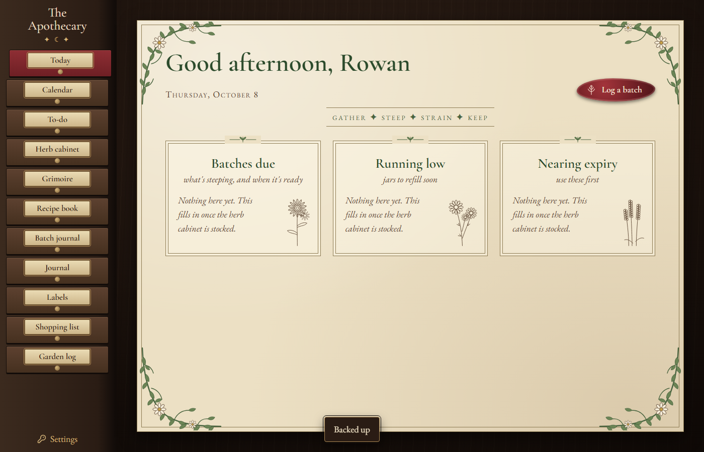

# The Apothecary

A home apothecary keeper for your herbs, remedies and notes. It runs on your own computer and sends nothing anywhere.



## What works so far

This is stage 1 of 8.

- Today shows a greeting and the sky timing for where you live.
- Settings holds your name, location, hemisphere and units, plus backups and restore.
- Backups run every night, and Settings has Back up now and Restore.
- The cabinet has eleven drawers. The ones not built yet say so.

## Install on Windows

You need Node 24 or newer (the LTS from https://nodejs.org). Then, in this folder:

```
npm run setup
npm run install-windows
```

The first command installs, builds and creates your data folder. The second adds a 5:30 AM start, a 9:30 PM backup and stop, and a Desktop shortcut called The Apothecary Dashboard.

If you would rather not do it yourself, ask Claude or another coding assistant to follow `AGENTS.md`.

## Use it

Double-click the Desktop shortcut, or open http://localhost:4197. To run it by hand, use `npm start`. To stop it, use `npm run stop`.

## Your data

Everything lives in `Documents\The Apothecary Data`: the database (`apothecary.db`), your photos, your labels, and the `backups\` folder. The app only answers to your own computer, so nobody else on your network can reach it. Backups are made each night when the app stops, and again at start if the last one is a day old. The newest 30 days are kept, and never fewer than 5 copies.

You can move the data folder by setting `dataDir` in `config.json`.

## The demo

`npm run demo` starts a copy with sample data on http://localhost:4201. It has its own folder, `Documents\The Apothecary Demo Data`, so your real data is never touched.

## Not medical advice

The grimoire to come will hold traditional uses and folklore for plants. It is a keepsake, not medical guidance. Talk to a doctor or pharmacist before you use any herb, especially if you are pregnant, nursing, on medication or treating a child.

## License

MIT. See `LICENSE`. Fonts and icons are credited in `NOTICE.md`.
