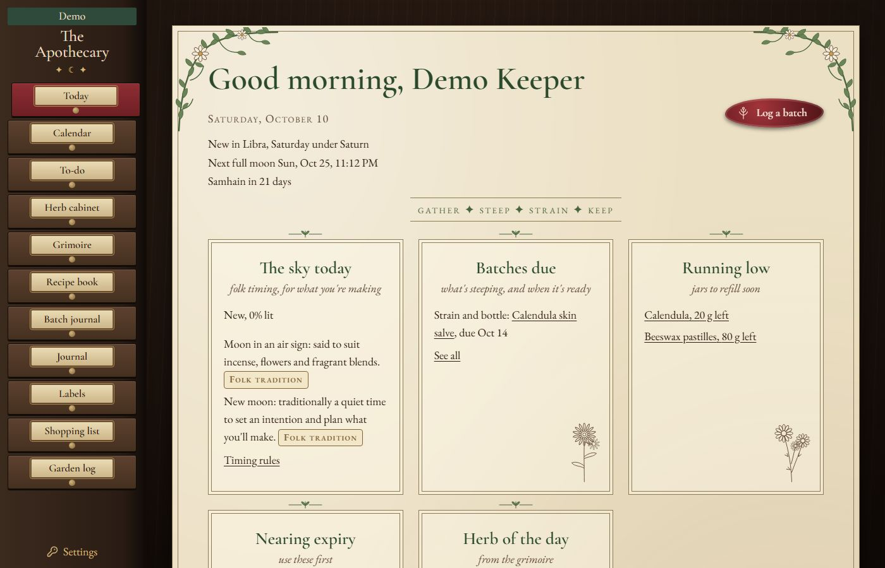
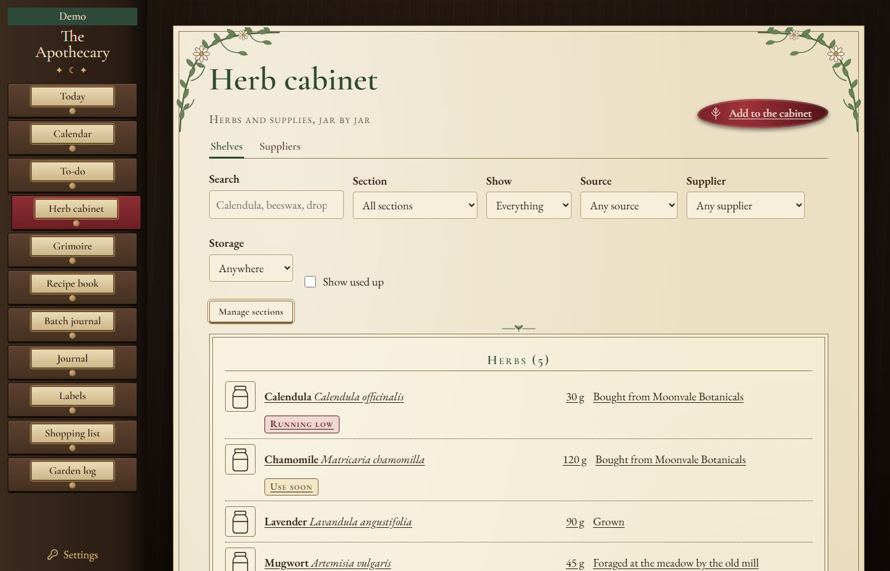
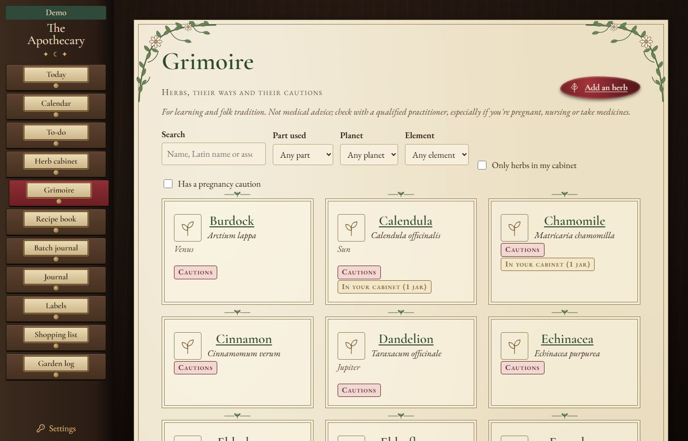
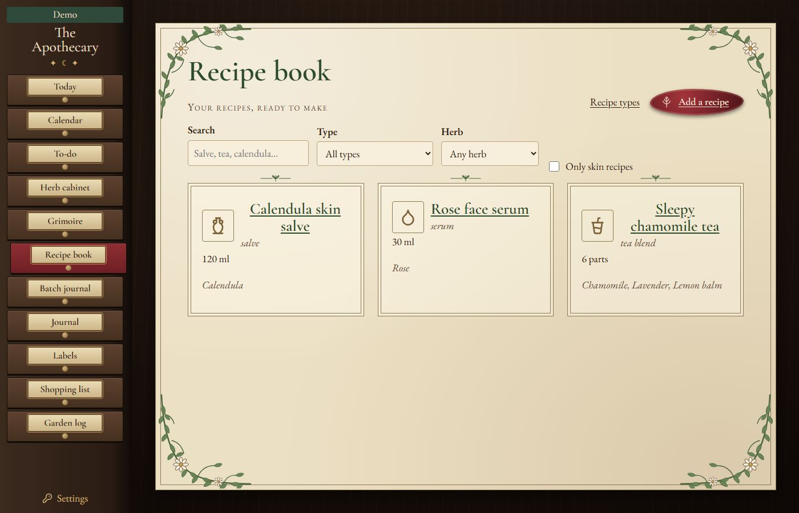

# The Apothecary

A home apothecary keeper for your herbs, remedies and notes. It runs on your own computer and sends nothing anywhere.



## What works so far

This is Stage 3A of 8. It adds the recipe book to the herb cabinet and the grimoire.

- Today shows a greeting and the date; moon and sky timing arrive in a later stage.
- Settings holds your name, location, hemisphere and units, plus backups and restore.
- Backups run every night, and Settings has Back up now and Restore.
- The herb cabinet holds your herbs and supplies, jar by jar. Each item records whether you bought, grew, foraged, made or were given it, keeps a purchase history, and takes photos. Suppliers get their own pages and ratings.
- Today lists jars that are running low, close to their use-by date, or past it.
- The grimoire holds 30 starter herbs: traditional uses, parts used, garden notes, and the planet and element where an old herbal gives one. Cautions come first on every herb page. You can add, edit and delete your own herbs and their sources. Herb jars in the cabinet link to their grimoire page, and Today shows an herb of the day.
- The recipe book keeps what you make. Recipe types are yours to manage: 22 starters you can edit, reorder or delete. A recipe takes ingredients from the grimoire or typed in, steps, wait time, shelf life, intention, timing notes and photos. Scale it by a factor or to the amount you want to end up with. Each recipe opens with its herbs' cautions, and skin recipes add a patch-test reminder. Herb pages list the recipes that use them.
- The other drawers say so when they are not built yet.



The grimoire is for learning and record keeping, not medical advice. Ask a doctor or pharmacist before using herbs, especially if you are pregnant, nursing, or take medicines. `docs/grimoire/research-log.md` explains how the starter entries were researched, and `docs/grimoire/safety-check.md` explains how every caution was checked against its sources.





## Install on Windows

You need Node 24 or newer (the LTS from https://nodejs.org). Then, in this folder:

```
npm run setup
npm run install-windows
```

The first command installs, builds and creates your data folder. The second adds a 5:30 AM start, a 9:30 PM backup and stop, and a Desktop shortcut called The Apothecary Dashboard.

If you would rather not do it yourself, ask Claude or another coding assistant to follow `AGENTS.md`.

## Use it

Double-click the Desktop shortcut, or open http://localhost:4197. To run it by hand, use `npm start`. To stop it, use `npm run stop`.

## Your data

Everything lives in `Documents\The Apothecary Data`: the database (`apothecary.db`), your photos, your labels, and the `backups\` folder. The app only answers to your own computer, so nobody else on your network can reach it. Backups are made each night when the app stops, and again at start if the last one is a day old. The newest 30 days are kept, and never fewer than 5 copies.

You can move the data folder by setting `dataDir` in `config.json`.

## The demo

`npm run demo` starts a copy with sample data on http://localhost:4201. It has its own folder, `Documents\The Apothecary Demo Data`, so your real data is never touched.

## Not medical advice

The grimoire holds traditional uses and folklore for plants. It is a keepsake, not medical guidance. Talk to a doctor or pharmacist before you use any herb, especially if you are pregnant, nursing, on medication or treating a child.

## License

MIT. See `LICENSE`. Fonts and icons are credited in `NOTICE.md`.
